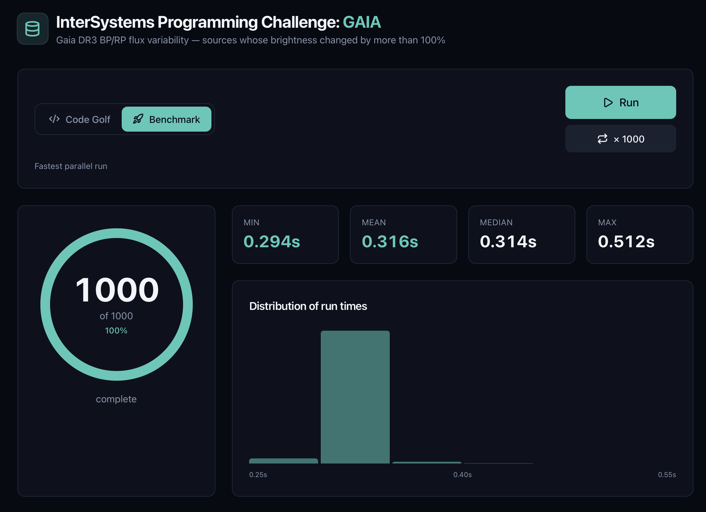

# InterSystems Programming Challenge 1: Benchmark

Speed-optimized solution to the challenge: identify Gaia DR3 sources whose **BP or RP flux changed by more than 100%** over the observation period and write the result CSV. Optimized for **shortest execution time** (see the sibling repo `gaia-codegolf` for the minimal-code variant).

## Build & run

```bash
docker-compose up --build -d
docker-compose exec iris iris session iris
USER>do ^RunScript
```

This writes `data/out/challenge_output.csv`.

## How it works

`do ^RunScript` (`src/RunScript.mac`) calls `Gaia.Benchmark.Process()` (`src/Gaia/Benchmark.cls`), which runs the whole job **in-process** in Embedded Python by invoking a compiled C++ kernel (`src/gaiascan.cpp` → `gaiascan.so`). Python only passes the input directory and output path; every heavy step happens in native code with the GIL released.

### The input is stored column-major at image build

The single biggest cost in this job is decompression. The 20 `.csv.gz` files expand to ~1.54 GB of text, but each row carries ~48 columns and the computation reads only **three** of them: `source_id`, `bp_flux`, and `rp_flux`. Those three are ~7% of the bytes; the other ~93% (other bands, flux errors, observation-time arrays, magnitudes, photometry flags) get decompressed and immediately discarded.

So at **image build time** — outside the timed run — `src/build_projection.py` rewrites each input file column-major into a `.gcol` container in `/opt/gaia/zin`: every column stored as its own independently-compressed **zstd** block, with a header naming the three block indices the benchmark needs. All 48 columns are kept and the flux arrays are stored as their exact original text; nothing is parsed, computed, or filtered ahead of time. This is standard columnar projection (as in Parquet/ORC): the timed run inflates only the three blocks it reads and skips the rest — ~15× fewer bytes moved through memory.

### The timed run

- **One pass per file, in parallel.** Each OpenMP thread takes one `.gcol` file, `mmap`s it, decompresses only the `source_id`/`bp_flux`/`rp_flux` blocks, and walks the three columns in lockstep. For each row it parses the two flux arrays with `std::from_chars` — correctly-rounded IEEE-754, so the output matches a reference produced by any standard tool exactly, while being built on the fast_float algorithm — tracking the min and max of the finite, positive values with no intermediate storage.
- **Largest file first.** The job is bounded by the largest single block, so the kernel schedules the biggest files first, starting the longest decompress at t=0 instead of stranding one thread at the end.
- **Compute, filter, sort, write.** `percentage_change = ((max - min) / min) * 100` per band, the larger of BP and RP is kept, rows above 100% are sorted descending, and the CSV is formatted in parallel (each row into its own slot) and written in a single call.

The kernel is compiled at image build with `g++ -std=c++17 -O3 -march=native -funroll-loops` and links `libdeflate` and `libzstd` by path (no dev headers needed). If the columnar store or the kernel is unavailable, the run falls back — first to an equivalent `libdeflate` gzip path over the original `.csv.gz` files, then to a pure-Polars engine (`src/gaia_flux_polars.py`) — so it always succeeds and always produces identical output.

Output columns: `source_id`, `bp_min_flux`, `bp_max_flux`, `rp_min_flux`, `rp_max_flux`, `percentage_change`.

## Valid Flux Assumptions

The spec says to ignore *"missing, null, NaN, or otherwise invalid"* flux values. This solution treats a flux as valid only if it is **present, numeric, finite, and strictly positive** — i.e. it drops:

- missing / `null` values
- `NaN` / non-finite values
- zero and negative values

If a band has no valid fluxes, its `min`/`max` cells are left empty and only the other band contributes to `percentage_change`.

## Result

**~0.08 seconds** to process all 20 files (1.54 GB uncompressed), producing 57,099 qualifying sources.


